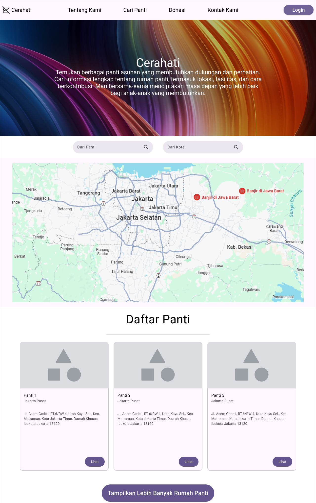
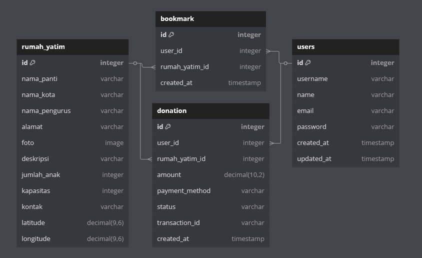

# Kelompok 9 SoA

## Case

Portal Rumah Yatim

## Nama Aplikasi

Cerahati

## Tentang Cerahati

Cerahati adalah portal digital yang menghubungkan panti asuhan dengan masyarakat yang ingin berbagi dan peduli. Melalui Cerahati, kamu dapat menemukan informasi lengkap tentang berbagai panti asuhan, mulai dari lokasi, jumlah anak asuh, hingga fasilitasnya. 

## Anggota

Dafa Andika Firmansyah - 2210511049  
Farel Bayhaqi - 2210511073  
Putra Mahandika - 2110511047  

## Summary Of Features

| Feature | Status |
|---------|---------|
| API Sederhana | 25 API Endpoints ✅ |
| API Kompleks | 15 API Endpoints ✅ |
| API NoSQL (Redis) | 13 API Endpoints ✅ |
| Frontend | EJS Template Engine ✅ |
| Database | MySQL ✅ |
| Authentication | JWT ✅ |
| Documentation | Inline & README ✅ |

## Website sejenis

- **kapilerindonesia**
- **pantiyatim**

## Front-End

[Cerahati Website Repository](https://github.com/zerrr232/SOA-Kel.9_Rumah-yatim)

## Mockup Halaman Utama



## ERD



## Installation

1. Clone repository:
```bash
git clone [URL_REPOSITORY]
cd cerahati
```

2. Install dependencies:
```bash
npm install
```

3. Setup environment variables:
```bash
cp .env.example .env
```
Edit file `.env` dengan kredensial database dan konfigurasi Redis.

4. Import database:
```bash
mysql -u [username] -p [database_name] < database/rumah-yatim.sql
```

5. Install dan jalankan Redis:
```bash
# Windows (menggunakan WSL)
wsl
sudo service redis-server start

# Linux
sudo systemctl start redis

# MacOS dengan Homebrew
brew services start redis
```

6. Jalankan aplikasi:
```bash
node app.js
```


## Features

### API Sederhana (25 Endpoints)

#### Auth Routes
- **POST** `/auth/register` — Registrasi user baru
- **POST** `/auth/login` — Login user
- **POST** `/auth/logout` — Logout user
- **POST** `/auth/refresh-token` — Refresh JWT token

#### Users Routes
- **GET** `/users` — Get semua users
- **GET** `/users/profile` — Get profil user
- **PUT** `/users/profile` — Update profil user
- **DELETE** `/users/:id` — Hapus user
- **GET** `/users/donations` — Get riwayat donasi user

#### Doa Routes
- **GET** `/doa` — Get semua doa
- **POST** `/doa/create` — Tambah doa baru
- **GET** `/doa/:id` — Get detail doa
- **PUT** `/doa/:id` — Update doa
- **DELETE** `/doa/:id` — Hapus doa

#### Bookmark Routes
- **GET** `/bookmark` — Get semua bookmark
- **POST** `/bookmark/add` — Tambah bookmark
- **DELETE** `/bookmark/:id` — Hapus bookmark
- **GET** `/bookmark/user` — Get bookmark by user

#### Rumah Yatim Basic Routes
- **GET** `/rumah-yatim/list` — Get daftar basic rumah yatim
- **POST** `/rumah-yatim/create` — Tambah rumah yatim baru
- **GET** `/rumah-yatim/basic/:id` — Get basic info rumah yatim
- **PUT** `/rumah-yatim/basic/:id` — Update basic info rumah yatim
- **DELETE** `/rumah-yatim/:id` — Hapus rumah yatim
- **POST** `/rumah-yatim/image` — Upload gambar rumah yatim

### API Kompleks (15 Endpoints)

#### Donation Complex Routes
- **POST** `/donation/create` — Buat donasi baru (dengan update leaderboard)
- **GET** `/donation/history` — Get riwayat donasi (dengan filtering & pagination)
- **GET** `/donation/:id` — Get detail donasi (dengan relasi)
- **GET** `/donation/statistics` — Get statistik donasi
- **GET** `/donation/monthly-report` — Get laporan donasi bulanan

#### Rumah Yatim Complex Routes
- **GET** `/rumah-yatim` — Get daftar rumah yatim dengan statistik
- **GET** `/rumah-yatim/:id` — Get detail rumah yatim dengan riwayat donasi
- **GET** `/rumah-yatim/:id/statistics` — Get statistik rumah yatim
- **GET** `/rumah-yatim/:id/donors` — Get daftar donatur
- **GET** `/rumah-yatim/nearby` — Get rumah yatim terdekat

#### User Complex Routes
- **GET** `/users/dashboard` — Get dashboard user
- **GET** `/users/donation-summary` — Get ringkasan donasi user
- **GET** `/users/impact-report` — Get laporan dampak donasi
- **GET** `/users/recommendations` — Get rekomendasi rumah yatim
- **GET** `/users/activity-log` — Get log aktivitas user

### API NoSQL - Cache Routes (13 Endpoints)

#### Leaderboard Cache
- **GET** `/cache/leaderboard` — Get leaderboard donatur
- **POST** `/cache/leaderboard/refresh` — Refresh cache leaderboard
- **GET** `/cache/leaderboard/monthly` — Get leaderboard bulanan

#### Donation Cache
- **GET** `/cache/donation` — Get semua data donasi
- **GET** `/cache/donation/:id` — Get detail donasi
- **GET** `/cache/donation/users/:id` — Get donasi per user

#### Users Cache
- **GET** `/cache/users` — Get semua data users
- **GET** `/cache/users/:id` — Get detail user
- **GET** `/cache/users/active` — Get users aktif

#### Rumah Yatim Cache
- **GET** `/cache/rumah-yatim` — Get semua data rumah yatim
- **GET** `/cache/rumah-yatim/:id` — Get detail rumah yatim
- **GET** `/cache/rumah-yatim/popular` — Get rumah yatim populer
- **GET** `/cache/rumah-yatim/featured` — Get rumah yatim unggulan

### Authentication & Authorization

Sistem menggunakan JWT (JSON Web Token) untuk autentikasi dengan fitur:
- Token expires setelah 1 jam
- Role-based access control (Admin, User)
- Secure password hashing dengan bcrypt
- Refresh token mechanism
- Rate limiting pada endpoint auth

